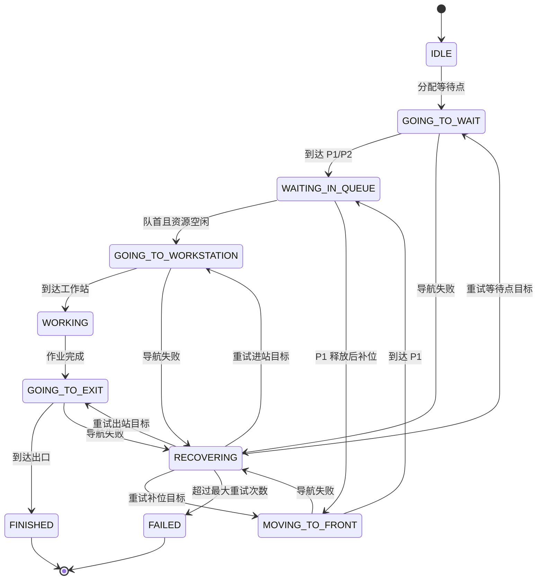

# ROS2 多机器人排队作业与共享资源调度系统

## 1. 项目简介

本项目面向多机器人共享工作站作业场景，基于 **ROS2 Humble、Nav2、Gazebo Classic、RViz2** 搭建双机器人协同调度系统。系统通过 namespace 隔离 `robot1` / `robot2` 的 `scan`、`odom`、`tf`、`cmd_vel` 和 Nav2 action server，实现多机器人独立定位、规划与控制；在此基础上设计 `queue_manager` 调度节点，将多机器人任务抽象为等待、补位、进站、作业、出站等状态，并引入等待点分配、工作站资源锁、出口通道锁、失败恢复、状态发布、RViz Marker 可视化和 CSV 实验日志统计。

项目重点解决多机器人在共享工作站场景下可能出现的资源冲突、等待点阻塞、通道抢占和任务卡死问题，使机器人能够按照队列顺序完成“进入等待区 → 自动补位 → 进入工作站 → 作业 → 离开出口”的完整闭环流程。

---

## 2. 项目功能

- 支持 Gazebo 中同时加载 `robot1` 和 `robot2`
- 支持多机器人 namespace 隔离
- 每台机器人拥有独立 Nav2 导航链路
- 支持 `robot1 -> P1`、`robot2 -> P2` 初始排队
- 支持 `robot1` 进入工作站后，`robot2` 从 `P2` 自动补位到 `P1`
- 支持工作站资源锁，保证同一时间只有一台机器人进入工作站
- 支持出口通道资源锁，避免出站和进站路径冲突
- 支持 `/queue_manager/status` 状态话题
- 支持 `/queue_manager/markers` RViz Marker 可视化
- 支持 `queue_result.csv` 实验日志自动记录
- 支持导航失败后的自动重试与资源释放
- 支持 `queue_config.yaml` 配置文件化管理点位、机器人、作业时间和恢复参数

---

## 3. 系统架构

```mermaid
flowchart TD
    A[Gazebo 仿真环境] --> B1[robot1 模型]
    A --> B2[robot2 模型]

    B1 --> C1[robot1 namespace]
    B2 --> C2[robot2 namespace]

    C1 --> D1[robot1 AMCL]
    C1 --> E1[robot1 Costmap]
    C1 --> F1[robot1 Planner / Controller]
    C1 --> G1[/robot1/navigate_to_pose]

    C2 --> D2[robot2 AMCL]
    C2 --> E2[robot2 Costmap]
    C2 --> F2[robot2 Planner / Controller]
    C2 --> G2[/robot2/navigate_to_pose]

    G1 --> H[queue_manager 调度节点]
    G2 --> H

    H --> I[等待队列管理]
    H --> J[工作站资源锁]
    H --> K[出口通道资源锁]
    H --> L[失败恢复机制]
    H --> M[状态话题 /queue_manager/status]
    H --> N[RViz Marker 可视化]
    H --> O[CSV 实验日志]
```

---

## 4. 调度状态机



---

## 5. 调度场景设计

默认场景中包含三个等待点、一个共享工作站和两个出口点：

| 名称 | 说明 | 坐标 |
|---|---|---|
| P1 | 队首等待点 | `(1.20, -0.65, 0.00)` |
| P2 | 第二等待点 | `(0.00, -0.65, 0.00)` |
| P3 | 预留等待点 | `(-1.20, -0.65, 0.00)` |
| WORKSTATION | 共享工作站 | `(3.00, -0.20, 0.00)` |
| EXIT_LEFT | robot1 出口点 | `(0.35, -2.00, -1.57)` |
| EXIT_RIGHT | robot2 出口点 | `(1.25, -2.00, -1.57)` |

基本流程：

```text
robot1 -> P1 -> WORKSTATION -> EXIT_LEFT
robot2 -> P2 -> P1 -> WORKSTATION -> EXIT_RIGHT
```

当 `robot1` 从 P1 进入工作站后，P1 被释放，`robot2` 会从 P2 自动前移到 P1，实现排队补位。当 `robot1` 作业完成并到达出口后，释放工作站锁和出口通道锁，`robot2` 才允许进入工作站。

---

## 6. 共享资源锁设计

系统将工作站和出口通道抽象为有限共享资源：

```text
WORKSTATION_LOCK：控制机器人是否允许进入工作站
EXIT_LANE_LOCK：控制机器人是否允许占用出口通道
```

调度规则：

1. 只有队首机器人可以申请进入工作站；
2. 进入工作站前需要申请 `WORKSTATION_LOCK`；
3. 机器人作业完成后，离开工作站前需要申请 `EXIT_LANE_LOCK`；
4. 机器人到达出口后释放 `WORKSTATION_LOCK` 和 `EXIT_LANE_LOCK`；
5. 下一台机器人只有在两个资源均空闲时才允许进入工作站。

该机制避免了如下冲突：

```text
robot1: WORKSTATION -> EXIT
robot2: P1 -> WORKSTATION
```

如果两个动作同时发生，容易在工作站入口或出口通道附近产生路径冲突。资源锁使系统在调度层面主动规避冲突。

---

## 7. 配置文件

核心配置文件：

```bash
src/queue_manager/config/queue_config.yaml
```

示例：

```yaml
queue_order:
  - robot1
  - robot2

front_wait_slot: P1

wait_slots:
  P1: [1.20, -0.65, 0.00]
  P2: [0.00, -0.65, 0.00]
  P3: [-1.20, -0.65, 0.00]

workstation:
  pose: [3.00, -0.20, 0.00]
  work_duration: 5.0

robots:
  - name: robot1
    initial_pose: [-3.50, 0.50, 0.00]
    wait_slot: P1
    exit_pose: [0.35, -2.00, -1.57]

  - name: robot2
    initial_pose: [-3.50, -0.50, 0.00]
    wait_slot: P2
    exit_pose: [1.25, -2.00, -1.57]

recovery:
  max_retry_count: 2
  retry_delay: 3.0

logging:
  result_csv_path: queue_result.csv
```

---

## 8. 环境依赖

- Ubuntu 22.04
- ROS2 Humble
- Nav2
- Gazebo Classic
- RViz2
- Python 3
- colcon
- xacro
- ros2_control

---

## 9. 编译方法

进入工作空间：

```bash
cd ~/ros2test/duoji/chapt7_ws
source /opt/ros/humble/setup.bash
colcon build --symlink-install
source install/setup.bash
```

只编译调度包：

```bash
colcon build --packages-select queue_manager --symlink-install
source install/setup.bash
```

---

## 10. 运行方法

终端1：启动Gazebo双机器人仿真

```bash
cd ~/ros2test/duoji/chapt7_ws
source install/setup.bash
ros2 launch fishbot_description gazebo_sim.launch.py
```

终端2：启动robot1 Nav2

```bash
cd ~/ros2test/duoji/chapt7_ws
source install/setup.bash
ros2 launch fishbot_navigation2 nav2_robot1.launch.py
```

终端 3：启动 robot2 Nav2

```bash
cd ~/ros2test/duoji/chapt7_ws
source install/setup.bash
ros2 launch fishbot_navigation2 nav2_robot2.launch.py
```

终端 4：启动 queue_manager

```bash
cd ~/ros2test/duoji/chapt7_ws
source install/setup.bash
ros2 run queue_manager multi_robot_queue_demo
```

---

## 11. 关键话题检查

检查 Nav2 action server：

```bash
ros2 action list | grep navigate
```

期望看到：

```text
/robot1/navigate_to_pose
/robot2/navigate_to_pose
```

检查状态话题：

```bash
ros2 topic echo /queue_manager/status
```

检查 Marker 话题：

```bash
ros2 topic list | grep queue_manager
```

期望看到：

```text
/queue_manager/status
/queue_manager/markers
```

---

## 12. RViz 可视化

在 RViz 中添加：

```text
Add -> By topic -> /queue_manager/markers -> MarkerArray
```

可视化内容包括：

- P1 / P2 / P3 等待点
- WORKSTATION 工作站
- EXIT_LEFT / EXIT_RIGHT 出口点
- WORKSTATION_LOCK 当前占用者
- EXIT_LANE_LOCK 当前占用者
- robot1 / robot2 当前状态
- 队列状态文本

---

## 13. 实验日志

程序运行后会自动生成：

```bash
queue_result.csv
```

字段包括：

```csv
robot_name,start_time,wait_arrival_time,front_wait_arrival_time,work_start_time,work_finish_time,exit_time,total_time,queue_wait_time,front_move_time,retry_count,failure_reason,recovery_status,status
```

可用于统计：

- 每台机器人总任务耗时
- 等待时间
- 补位耗时
- 是否发生失败恢复
- 最终任务状态

---

## 14. 失败恢复机制

当机器人导航失败时，系统不会立刻退出，而是进入 `RECOVERING` 状态：

```text
导航失败
↓
进入 RECOVERING
↓
等待 retry_delay 秒
↓
重新发送上一个目标
↓
超过 max_retry_count 后标记 FAILED
↓
释放其占用的资源锁
```

这样可以避免某个机器人异常后永久占用工作站或出口通道，导致整个队列卡死。

---

## 15. 项目亮点

1. **多机器人独立导航**  
   通过 namespace 隔离多台机器人传感器、里程计、TF、控制话题和 Nav2 action server。

2. **调度层与导航层解耦**  
   Nav2 负责单机器人路径规划与控制，`queue_manager` 负责多机器人任务顺序、资源分配和状态切换。

3. **排队补位机制**  
   后续机器人不需要一直等待在起点，可以提前移动到等待区，并在队首释放后自动前移。

4. **共享资源锁机制**  
   将工作站和出口通道抽象为有限资源，通过锁机制避免多机器人同时进入冲突区域。

5. **失败恢复机制**  
   导航失败后自动重试，超过次数后释放资源，避免系统卡死。

6. **可视化和实验评估**  
   支持 RViz Marker 展示队列状态，并自动生成 CSV 日志用于统计调度效果。

---

## 16. 后续可扩展方向

- 扩展到三台及以上机器人
- 增加多个工作站和任务优先级
- 使用任务代价函数进行等待点分配
- 加入机器人间实时距离约束
- 接入真实机器人多机 ROS2 网络
- 增加 Web 可视化调度界面
- 增加任务动态插入与取消机制
