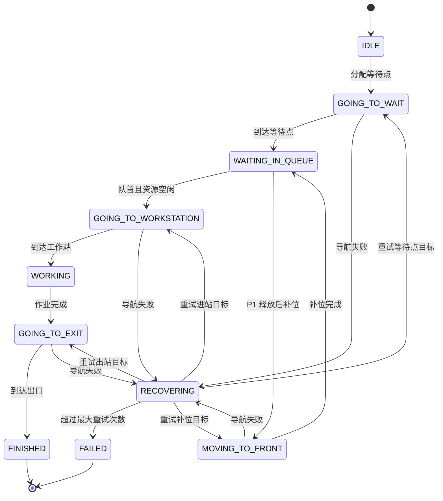

# ROS2 Nav2 多机器人排队作业与共享资源调度系统

> 基于 ROS2 Humble、Nav2、Gazebo 与 RViz 的多机器人共享工作站排队调度项目，支持多机器人独立导航、等待点排队、自动补位、资源锁互斥、失败恢复、状态可视化与实验日志统计。

---

## 1. 项目简介

本项目面向 **多机器人共享工作站作业场景**，基于 **ROS2 Humble + Nav2 + Gazebo Classic + RViz2** 搭建双机器人协同调度系统。

在底层导航部分，系统通过 namespace 隔离 `robot1` 和 `robot2` 的 `scan`、`odom`、`tf`、`cmd_vel` 以及 Nav2 action server，使两台机器人能够独立完成定位、全局规划、局部控制和目标点导航。

在上层调度部分，项目设计了 `queue_manager` 调度节点，将多机器人任务流程抽象为 **前往等待点、队列等待、自动补位、进入工作站、作业执行、前往出口、任务完成** 等状态，并引入 **工作站资源锁** 和 **出口通道资源锁**，解决多机器人同时访问共享资源时可能出现的工作站抢占、等待点阻塞、通道冲突和队列卡死问题。

---

## 2. 项目效果

默认调度流程如下：

```text
robot1 -> P1 -> WORKSTATION -> EXIT_LEFT
robot2 -> P2 -> P1 -> WORKSTATION -> EXIT_RIGHT
```

运行逻辑：

1. `robot1` 前往队首等待点 `P1`
2. `robot2` 前往第二等待点 `P2`
3. `robot1` 进入 `WORKSTATION` 后，释放 `P1`
4. `robot2` 从 `P2` 自动补位到 `P1`
5. `robot1` 作业完成并到达出口后，释放工作站锁和出口通道锁
6. `robot2` 获得资源后进入工作站
7. 两台机器人依次完成共享工作站作业任务

---

## 3. 功能特性

- 支持 Gazebo 中同时加载两台移动机器人
- 支持 `robot1` / `robot2` 多机器人 namespace 隔离
- 支持两套独立 Nav2 导航系统
- 支持 `/robot1/navigate_to_pose` 与 `/robot2/navigate_to_pose`
- 支持等待点 `P1 / P2 / P3` 配置
- 支持 `P2 -> P1` 自动补位逻辑
- 支持工作站资源锁 `WORKSTATION_LOCK`
- 支持出口通道资源锁 `EXIT_LANE_LOCK`
- 支持导航失败自动重试
- 支持异常机器人释放资源锁，防止队列卡死
- 支持 `/queue_manager/status` 状态话题
- 支持 `/queue_manager/markers` RViz Marker 可视化
- 支持 `queue_result.csv` 实验日志统计
- 支持 `queue_config.yaml` 配置文件化管理

---

## 4. 系统架构

```mermaid
flowchart TD
    A[Gazebo 仿真环境] --> B1[robot1]
    A --> B2[robot2]

    B1 --> C1[/robot1 namespace]
    B2 --> C2[/robot2 namespace]

    C1 --> D1[AMCL 定位]
    C1 --> E1[Global / Local Costmap]
    C1 --> F1[Planner / Controller]
    C1 --> G1[/robot1/navigate_to_pose]

    C2 --> D2[AMCL 定位]
    C2 --> E2[Global / Local Costmap]
    C2 --> F2[Planner / Controller]
    C2 --> G2[/robot2/navigate_to_pose]

    G1 --> H[queue_manager 调度节点]
    G2 --> H

    H --> I[等待队列管理]
    H --> J[自动补位逻辑]
    H --> K[工作站资源锁]
    H --> L[出口通道资源锁]
    H --> M[失败恢复机制]
    H --> N[状态话题发布]
    H --> O[RViz Marker 可视化]
    H --> P[CSV 实验日志]
```

---

## 5. 调度状态机



---

## 6. 项目目录结构

```text
ros2-nav2-multi-robot-queue-scheduling/
├── README.md
├── docs/
│   ├── architecture.md
│   ├── resume_description.md
│   └── interview_script.md
└── src/
    ├── fishbot_description/
    │   ├── launch/
    │   ├── urdf/
    │   ├── config/
    │   └── world/
    ├── fishbot_navigation2/
    │   ├── launch/
    │   ├── config/
    │   └── maps/
    └── queue_manager/
        ├── queue_manager/
        │   └── multi_robot_queue_demo.py
        ├── config/
        │   └── queue_config.yaml
        ├── package.xml
        └── setup.py
```

---

## 7. 环境依赖

- Ubuntu 22.04
- ROS2 Humble
- Nav2
- Gazebo Classic
- RViz2
- Python 3
- colcon
- xacro
- ros2_control

安装常用依赖：

```bash
sudo apt update
sudo apt install ros-humble-navigation2 ros-humble-nav2-bringup
sudo apt install ros-humble-gazebo-ros-pkgs ros-humble-gazebo-ros2-control
sudo apt install ros-humble-xacro ros-humble-ros2-control ros-humble-ros2-controllers
```

---

## 8. 编译方法

进入工作空间：

```bash
cd ~/ros2test/duoji/chapt7_ws
source /opt/ros/humble/setup.bash
colcon build --symlink-install
source install/setup.bash
```

只编译调度包：

```bash
colcon build --packages-select queue_manager --symlink-install
source install/setup.bash
```

---

## 9. 运行方法

### 终端 1：启动 Gazebo 双机器人仿真

```bash
cd ~/ros2test/duoji/chapt7_ws
source install/setup.bash
ros2 launch fishbot_description gazebo_sim.launch.py
```

### 终端 2：启动 robot1 Nav2

```bash
cd ~/ros2test/duoji/chapt7_ws
source install/setup.bash
ros2 launch fishbot_navigation2 nav2_robot1.launch.py
```

### 终端 3：启动 robot2 Nav2

```bash
cd ~/ros2test/duoji/chapt7_ws
source install/setup.bash
ros2 launch fishbot_navigation2 nav2_robot2.launch.py
```

### 终端 4：启动 queue_manager

```bash
cd ~/ros2test/duoji/chapt7_ws
source install/setup.bash
ros2 run queue_manager multi_robot_queue_demo
```

---

## 10. 配置文件说明

核心配置文件：

```bash
src/queue_manager/config/queue_config.yaml
```

示例配置：

```yaml
queue_order:
  - robot1
  - robot2

front_wait_slot: P1

wait_slots:
  P1: [1.20, -0.65, 0.00]
  P2: [0.00, -0.65, 0.00]
  P3: [-1.20, -0.65, 0.00]

workstation:
  pose: [3.00, -0.20, 0.00]
  work_duration: 5.0

robots:
  - name: robot1
    initial_pose: [-3.50, 0.50, 0.00]
    wait_slot: P1
    exit_pose: [0.35, -2.00, -1.57]

  - name: robot2
    initial_pose: [-3.50, -0.50, 0.00]
    wait_slot: P2
    exit_pose: [1.25, -2.00, -1.57]

recovery:
  max_retry_count: 2
  retry_delay: 3.0

logging:
  result_csv_path: queue_result.csv
```

---

## 11. 关键话题检查

检查 Nav2 action server：

```bash
ros2 action list | grep navigate
```

期望输出：

```text
/robot1/navigate_to_pose
/robot2/navigate_to_pose
```

检查机器人话题：

```bash
ros2 topic list | grep robot1
ros2 topic list | grep robot2
```

重点检查：

```text
/robot1/scan
/robot1/odom
/robot1/cmd_vel
/robot2/scan
/robot2/odom
/robot2/cmd_vel
```

检查调度状态话题：

```bash
ros2 topic echo /queue_manager/status
```

检查调度可视化话题：

```bash
ros2 topic list | grep queue_manager
```

期望看到：

```text
/queue_manager/status
/queue_manager/markers
```

---

## 12. RViz 可视化

在 RViz 中添加：

```text
Add -> By topic -> /queue_manager/markers -> MarkerArray
```

可视化内容包括：

- `P1 / P2 / P3` 等待点
- `WORKSTATION` 工作站
- `EXIT_LEFT / EXIT_RIGHT` 出口点
- `WORKSTATION_LOCK` 当前占用者
- `EXIT_LANE_LOCK` 当前占用者
- `robot1 / robot2` 当前调度状态
- 当前队列状态文本

---

## 13. 实验日志

程序运行后会自动生成：

```bash
queue_result.csv
```

字段包括：

```csv
robot_name,start_time,wait_arrival_time,front_wait_arrival_time,work_start_time,work_finish_time,exit_time,total_time,queue_wait_time,front_move_time,retry_count,failure_reason,recovery_status,status
```

可用于统计：

- 每台机器人总任务耗时
- 排队等待时间
- 补位耗时
- 作业完成状态
- 导航失败恢复次数
- 系统调度稳定性

---

## 14. 失败恢复机制

当机器人导航失败时，系统不会立即终止，而是进入 `RECOVERING` 状态：

```text
导航失败
↓
进入 RECOVERING
↓
等待 retry_delay 秒
↓
重新发送上一个目标
↓
超过 max_retry_count 后标记 FAILED
↓
释放其占用的资源锁
```

这样可以避免某台机器人失败后永久占用工作站或出口通道，导致整个队列卡死。

---

## 15. 项目亮点

### 多机器人独立导航

通过 namespace 隔离多台机器人的传感器、里程计、TF、速度控制话题和 Nav2 action server，使两台机器人能够独立定位、规划和控制。

### 调度层与导航层解耦

Nav2 负责单机器人路径规划与控制，`queue_manager` 负责多机器人任务顺序、等待队列、资源分配和状态切换，系统结构清晰。

### 排队补位机制

后续机器人不需要一直等待在起点，可以提前进入等待区，并在队首等待点释放后自动前移，提高任务连续性。

### 共享资源锁机制

将工作站和出口通道抽象为有限共享资源，通过资源锁机制避免多机器人同时进入冲突区域。

### 失败恢复机制

导航失败后自动重试，超过最大次数后释放资源锁，避免异常机器人导致整个队列系统卡死。

### 可视化与实验评估

支持 RViz Marker 展示队列状态，并自动生成 CSV 日志，用于统计任务耗时、等待时间和失败恢复情况。

---

## 16. 项目难点

1. **多机器人 namespace 与 TF 配置**  
   需要保证每台机器人使用独立的 `odom`、`base_footprint`、`scan` 和 `cmd_vel`，避免话题或坐标系混用。

2. **Nav2 多实例启动**  
   需要分别启动 `robot1` 和 `robot2` 的 Nav2，并确保生成 `/robot1/navigate_to_pose` 和 `/robot2/navigate_to_pose`。

3. **共享资源冲突处理**  
   多机器人访问同一工作站时，不能只依赖局部避障，还需要调度层判断资源是否可用。

4. **队列补位与资源释放时机**  
   需要准确判断 P1 何时释放、机器人何时进入工作站、何时释放工作站锁和出口通道锁。

5. **失败恢复与系统防卡死**  
   当机器人导航失败时，需要自动重试，并在失败后释放资源，防止后续机器人永久等待。

---

## 17. 适用场景

-工厂AGV共享工作站上料/下料
- 仓储机器人排队取货
- 服务机器人排队进入狭窄区域
- 多机器人共享充电桩调度
- 多机器人共享通道通行控制
- 移动机器人路径规划与任务调度教学实验

---

## 18. 后续优化方向

- 扩展到三台及以上机器人
- 支持多个工作站
- 增加任务优先级
- 增加动态任务插入与取消
- 增加机器人间实时距离约束
- 增加死锁检测与解除机制
- 接入真实机器人多机 ROS2 网络
- 增加 Web 调度监控界面
- 将资源锁扩展为更细粒度的区域锁

---

## 19. 简历描述参考

robot1/robot2的`扫描`、`里程计`、`TF`、`cmd_vel`与Nav2动作服务器，实现多机器人独立定位、规划与控制；设计`queue_manager`调度节点，将任务流程抽象为等待点导航、队列等待、自动补位、进入工作站、作业执行和出站完成等状态。针对多机器人同时访问共享资源可能产生的工作站抢占、等待点阻塞和通道冲突问题，引入工作站锁与出口通道锁机制，并增加失败恢复、状态话题、RViz Marker 可视化和 CSV 日志统计，提高系统的可观测性、稳定性和工程完整度。

---

##20. 许可证

本项目用于学习、研究及机器人系统开发实践。
